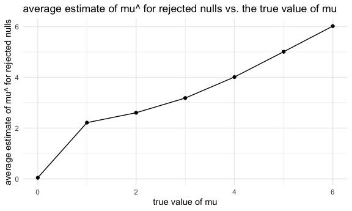

Homework 5
================
Mufeng Xu
2020-11-18

## Problem 1

Read in the data.

``` r
homicide_df = 
  read_csv("./data/homicide_data/homicide-data.csv") %>% 
  mutate(
    city_state = str_c(city, state, sep = "_"),
    resolved = case_when(
      disposition == "Closed without arrest" ~ "unsolved",
      disposition == "Open/No arrest"        ~ "unsolved",
      disposition == "Closed by arrest"      ~ "solved",
    )
  ) %>% 
  select(city_state, resolved) %>% 
  filter(city_state != "Tulsa_AL")
```

    ## Parsed with column specification:
    ## cols(
    ##   uid = col_character(),
    ##   reported_date = col_double(),
    ##   victim_last = col_character(),
    ##   victim_first = col_character(),
    ##   victim_race = col_character(),
    ##   victim_age = col_character(),
    ##   victim_sex = col_character(),
    ##   city = col_character(),
    ##   state = col_character(),
    ##   lat = col_double(),
    ##   lon = col_double(),
    ##   disposition = col_character()
    ## )

Let’s look at this a bit

``` r
aggregate_df = 
  homicide_df %>% 
  group_by(city_state) %>% 
  summarize(
    hom_total = n(),
    hom_unsolved = sum(resolved == "unsolved")
  )
```

    ## `summarise()` ungrouping output (override with `.groups` argument)

Can I do a prop test for a single city?

``` r
prop.test(
  aggregate_df %>% filter(city_state == "Baltimore_MD") %>% pull(hom_unsolved), 
  aggregate_df %>% filter(city_state == "Baltimore_MD") %>% pull(hom_total)) %>% 
  broom::tidy()
```

    ## # A tibble: 1 x 8
    ##   estimate statistic  p.value parameter conf.low conf.high method    alternative
    ##      <dbl>     <dbl>    <dbl>     <int>    <dbl>     <dbl> <chr>     <chr>      
    ## 1    0.646      239. 6.46e-54         1    0.628     0.663 1-sample… two.sided

Try to iterate ……..

``` r
# map2 has 2 variables available for mapping
results_df = 
  aggregate_df %>% 
  mutate(
    prop_tests = map2(.x = hom_unsolved, .y = hom_total, ~prop.test(x = .x, n = .y)),
    tidy_tests = map(.x = prop_tests, ~broom::tidy(.x))
  ) %>% 
  select(-prop_tests) %>% 
  unnest(tidy_tests) %>% 
  select(city_state, estimate, conf.low, conf.high)
```

Make a plot

``` r
results_df %>% 
  mutate(city_state = fct_reorder(city_state, estimate)) %>% 
  ggplot(aes(x = city_state, y = estimate)) +
  geom_point() + 
  geom_errorbar(aes(ymin = conf.low, ymax = conf.high)) + 
  theme(axis.text.x = element_text(angle = 90, vjust = 0.5, hjust = 1))
```


## Problem 2

import one dataset

``` r
lda_df = 
  tibble(
    path = list.files("data/lda_data")
  ) %>% 
  mutate(
    path = str_c("data/lda_data/", path),
    data = map(.x = path, ~read_csv(.x))
  ) %>% 
  unnest(data) %>% # read data
  separate(
    path,
    into = c("path_prefix1", "path_prefix2", "path_prefix3", "arm", "id", "csv"),
    sep = "([//_.])"
  ) %>% 
  select(
    -path_prefix1, -path_prefix2, -path_prefix3, -csv
    ) %>% # separate the arm/id column into 2
  mutate(
    arm = case_when(
      arm == "con" ~ "control",
      arm == "exp" ~ "experimental"
    ),
    id = as.double(id)
  ) %>% 
  pivot_longer(
    week_1:week_8,
    names_prefix = "week_",
    names_to = "week",
    values_to = "observation"
  ) # tidy data
```

    ## Parsed with column specification:
    ## cols(
    ##   week_1 = col_double(),
    ##   week_2 = col_double(),
    ##   week_3 = col_double(),
    ##   week_4 = col_double(),
    ##   week_5 = col_double(),
    ##   week_6 = col_double(),
    ##   week_7 = col_double(),
    ##   week_8 = col_double()
    ## )
    ## Parsed with column specification:
    ## cols(
    ##   week_1 = col_double(),
    ##   week_2 = col_double(),
    ##   week_3 = col_double(),
    ##   week_4 = col_double(),
    ##   week_5 = col_double(),
    ##   week_6 = col_double(),
    ##   week_7 = col_double(),
    ##   week_8 = col_double()
    ## )
    ## Parsed with column specification:
    ## cols(
    ##   week_1 = col_double(),
    ##   week_2 = col_double(),
    ##   week_3 = col_double(),
    ##   week_4 = col_double(),
    ##   week_5 = col_double(),
    ##   week_6 = col_double(),
    ##   week_7 = col_double(),
    ##   week_8 = col_double()
    ## )
    ## Parsed with column specification:
    ## cols(
    ##   week_1 = col_double(),
    ##   week_2 = col_double(),
    ##   week_3 = col_double(),
    ##   week_4 = col_double(),
    ##   week_5 = col_double(),
    ##   week_6 = col_double(),
    ##   week_7 = col_double(),
    ##   week_8 = col_double()
    ## )
    ## Parsed with column specification:
    ## cols(
    ##   week_1 = col_double(),
    ##   week_2 = col_double(),
    ##   week_3 = col_double(),
    ##   week_4 = col_double(),
    ##   week_5 = col_double(),
    ##   week_6 = col_double(),
    ##   week_7 = col_double(),
    ##   week_8 = col_double()
    ## )
    ## Parsed with column specification:
    ## cols(
    ##   week_1 = col_double(),
    ##   week_2 = col_double(),
    ##   week_3 = col_double(),
    ##   week_4 = col_double(),
    ##   week_5 = col_double(),
    ##   week_6 = col_double(),
    ##   week_7 = col_double(),
    ##   week_8 = col_double()
    ## )
    ## Parsed with column specification:
    ## cols(
    ##   week_1 = col_double(),
    ##   week_2 = col_double(),
    ##   week_3 = col_double(),
    ##   week_4 = col_double(),
    ##   week_5 = col_double(),
    ##   week_6 = col_double(),
    ##   week_7 = col_double(),
    ##   week_8 = col_double()
    ## )
    ## Parsed with column specification:
    ## cols(
    ##   week_1 = col_double(),
    ##   week_2 = col_double(),
    ##   week_3 = col_double(),
    ##   week_4 = col_double(),
    ##   week_5 = col_double(),
    ##   week_6 = col_double(),
    ##   week_7 = col_double(),
    ##   week_8 = col_double()
    ## )
    ## Parsed with column specification:
    ## cols(
    ##   week_1 = col_double(),
    ##   week_2 = col_double(),
    ##   week_3 = col_double(),
    ##   week_4 = col_double(),
    ##   week_5 = col_double(),
    ##   week_6 = col_double(),
    ##   week_7 = col_double(),
    ##   week_8 = col_double()
    ## )
    ## Parsed with column specification:
    ## cols(
    ##   week_1 = col_double(),
    ##   week_2 = col_double(),
    ##   week_3 = col_double(),
    ##   week_4 = col_double(),
    ##   week_5 = col_double(),
    ##   week_6 = col_double(),
    ##   week_7 = col_double(),
    ##   week_8 = col_double()
    ## )
    ## Parsed with column specification:
    ## cols(
    ##   week_1 = col_double(),
    ##   week_2 = col_double(),
    ##   week_3 = col_double(),
    ##   week_4 = col_double(),
    ##   week_5 = col_double(),
    ##   week_6 = col_double(),
    ##   week_7 = col_double(),
    ##   week_8 = col_double()
    ## )
    ## Parsed with column specification:
    ## cols(
    ##   week_1 = col_double(),
    ##   week_2 = col_double(),
    ##   week_3 = col_double(),
    ##   week_4 = col_double(),
    ##   week_5 = col_double(),
    ##   week_6 = col_double(),
    ##   week_7 = col_double(),
    ##   week_8 = col_double()
    ## )
    ## Parsed with column specification:
    ## cols(
    ##   week_1 = col_double(),
    ##   week_2 = col_double(),
    ##   week_3 = col_double(),
    ##   week_4 = col_double(),
    ##   week_5 = col_double(),
    ##   week_6 = col_double(),
    ##   week_7 = col_double(),
    ##   week_8 = col_double()
    ## )
    ## Parsed with column specification:
    ## cols(
    ##   week_1 = col_double(),
    ##   week_2 = col_double(),
    ##   week_3 = col_double(),
    ##   week_4 = col_double(),
    ##   week_5 = col_double(),
    ##   week_6 = col_double(),
    ##   week_7 = col_double(),
    ##   week_8 = col_double()
    ## )
    ## Parsed with column specification:
    ## cols(
    ##   week_1 = col_double(),
    ##   week_2 = col_double(),
    ##   week_3 = col_double(),
    ##   week_4 = col_double(),
    ##   week_5 = col_double(),
    ##   week_6 = col_double(),
    ##   week_7 = col_double(),
    ##   week_8 = col_double()
    ## )
    ## Parsed with column specification:
    ## cols(
    ##   week_1 = col_double(),
    ##   week_2 = col_double(),
    ##   week_3 = col_double(),
    ##   week_4 = col_double(),
    ##   week_5 = col_double(),
    ##   week_6 = col_double(),
    ##   week_7 = col_double(),
    ##   week_8 = col_double()
    ## )
    ## Parsed with column specification:
    ## cols(
    ##   week_1 = col_double(),
    ##   week_2 = col_double(),
    ##   week_3 = col_double(),
    ##   week_4 = col_double(),
    ##   week_5 = col_double(),
    ##   week_6 = col_double(),
    ##   week_7 = col_double(),
    ##   week_8 = col_double()
    ## )
    ## Parsed with column specification:
    ## cols(
    ##   week_1 = col_double(),
    ##   week_2 = col_double(),
    ##   week_3 = col_double(),
    ##   week_4 = col_double(),
    ##   week_5 = col_double(),
    ##   week_6 = col_double(),
    ##   week_7 = col_double(),
    ##   week_8 = col_double()
    ## )
    ## Parsed with column specification:
    ## cols(
    ##   week_1 = col_double(),
    ##   week_2 = col_double(),
    ##   week_3 = col_double(),
    ##   week_4 = col_double(),
    ##   week_5 = col_double(),
    ##   week_6 = col_double(),
    ##   week_7 = col_double(),
    ##   week_8 = col_double()
    ## )
    ## Parsed with column specification:
    ## cols(
    ##   week_1 = col_double(),
    ##   week_2 = col_double(),
    ##   week_3 = col_double(),
    ##   week_4 = col_double(),
    ##   week_5 = col_double(),
    ##   week_6 = col_double(),
    ##   week_7 = col_double(),
    ##   week_8 = col_double()
    ## )

``` r
lda_df %>% 
  mutate(
    arm_id = str_c(arm, "arm", id, sep = "_")
  ) %>% 
  ggplot(aes(x = week, y = observation, group = arm_id, color = arm)) +
  geom_line() +
  geom_point(size = 1) +
  theme_bw() +
  labs(
    title = "Spaghetti Plot of Observations on Each Subject over Time",
    x = "Week",
    y = "Observation Value"
    )
```


According to the spaghetti plot above, it can be observed that
observation values of experimental arm are generally higher than those
of control arm; observation values of experimental arm increases faster
than those of control arm for the first some weeks; control values are
more stable than experimental values; from week 7, all observation
values for the experimental arm are higher than those of the control
arm.

## Problem 3

``` r
# create a function to generate random samples and conduct t tests
sim_t_test = function(samp_size = 30, mu, sigma = 5){
  
  sim_data = 
    tibble(
      data = rnorm(n = samp_size, mean = mu, sd = sigma)
   )
  
  sim_data %>% 
    t.test(alternative = "two.sided", conf.level = 0.95) %>% 
    broom::tidy() %>% 
    select(estimate, p.value)
  
}

# generate 5000 datasets for all mu's
sim_results = 
  tibble(mu = c(0:6)) %>% 
  mutate(
    output_lists = map(.x = mu, ~rerun(5000, sim_t_test(samp_size = 30, mu = .x))),
    estimate_df = map(output_lists, bind_rows)
  ) %>% 
  unnest(estimate_df) %>% 
  select(-output_lists)

# calculate rejection proportion
power_df = 
  sim_results %>% 
  mutate(
    rejection = case_when(
      p.value < 0.05 ~1,
      p.value >= 0.05 ~0
    )
  ) %>% 
  group_by(mu) %>% 
  summarize(
    reject_prop = mean(rejection)
  )
```

    ## `summarise()` ungrouping output (override with `.groups` argument)

``` r
power_df %>% 
  ggplot(aes(x = mu, y = reject_prop)) +
  geom_point() +
  labs(
    title = "Proportion of times the null was rejected vs. the true value of mu",
    x = "true mean",
    y = "power of the test"
  )
```


Based on the plot, it is observed that as the effect size(true mean)
increases, power(proportion of times the null hypothesis was rejected)
increases. For true mean equals to 0, the power of the test is expected
to be around 0.05. As the true mean increases, it is less likely that
the mean of the randomized samples is equal to 0, and it is more likely
that the null hypothesis is rejected; in other words, the power of the
test is getting larger.

``` r
all_samp = 
  sim_results %>% 
  group_by(mu) %>% 
  summarize(
    mean_estimate = mean(estimate)
  ) %>% 
  ggplot(aes(x = mu, y = mean_estimate)) +
  geom_point() +
  geom_line() +
  labs(
    title = "average estimate of mu^ vs. the true value of mu",
    x = "true value of mu",
    y = "average estimate of mu^"
  )
```

    ## `summarise()` ungrouping output (override with `.groups` argument)

``` r
plot(all_samp)
```


``` r
reject_samp = 
  sim_results %>% 
  filter(p.value < 0.05) %>% 
  group_by(mu) %>% 
  summarize(
    average_estimate = mean(estimate)
  ) %>% 
  ggplot(aes(x = mu, y = average_estimate)) +
  geom_point() +
  geom_line() +
  labs(
    title = "average estimate of mu^ for rejected nulls vs. the true value of mu",
    x = "true value of mu",
    y = "average estimate of mu^ for rejected nulls"
  )
```

    ## `summarise()` ungrouping output (override with `.groups` argument)

``` r
plot(reject_samp)
```



For average estimate of mu^ for all samples vs. the true value of mu
plot, it shows a perfect linear relationship between x and y, which
indicates that the average estimate of mu^ for all samples is approx.
equal to the true value of mu.

For average estimate of mu^ for rejected nulls vs. the true value of mu,
it shows that for true value of mu \>= 4, the average estimate of mu^ is
equal to true mean; for 1 \<= true mean \< 4, the average estimate of
mu^ is greater than the true mean; for true mean = 0, the average
estimate of mu^ is slightly below the true mean(approx. equal to true
mean).

The reasoning of the trend is that the samples for null rejection(the
second plot) have a power of 1. And the power for all samples:

| mu | reject\_prop |
| -: | -----------: |
|  0 |       0.0508 |
|  1 |       0.1890 |
|  2 |       0.5684 |
|  3 |       0.8872 |
|  4 |       0.9918 |
|  5 |       1.0000 |
|  6 |       1.0000 |

As the true value of mu \>= 4, power is above 0.99, which is extremely
close to 1, and the average estimate for all samples is mostly based on
“null rejecting” samples, so that for 4 \<= true value of mu \<= 6,
the sample average of mu^ across tests for which the null is rejected
approx. equal to the true value of mu.

For 1 \<= the true value of mu \< 4, powers of all samples are
significantly lower than 1. The critical value for rejecting null
hypothesis stays the same for all mu’s. For 2 sided hypothesis testing,
normally distributed samples for mu = 1:4, the right tail of the
rejection values is heavier than left tail’s, so that if there are only
null rejecting samples, the average estimates are overestimated.
Therefore, for 1 \<= the true value of mu \< 4, the sample average of
mu^ across tests for which the null is rejected do not equal to the true
value of mu.

For the true value of mu = 0, although powers are significantly
different for all samples and “only null rejecting” samples, with the
true mean of 0, the rejection region for normally distributed samples is
located at tail ends, and centered around 0. So the average estimates
are balanced to zero. It yields the result that for mu = 0, sample
average of mu^ across tests for which the null is rejected approx. equal
to the true value of mu.
